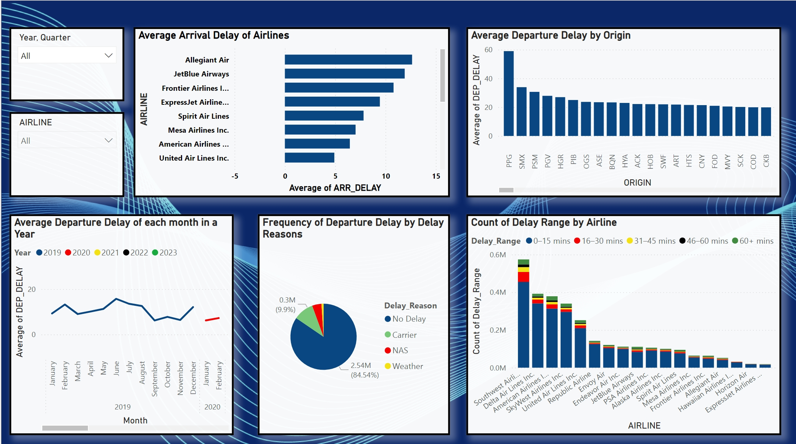
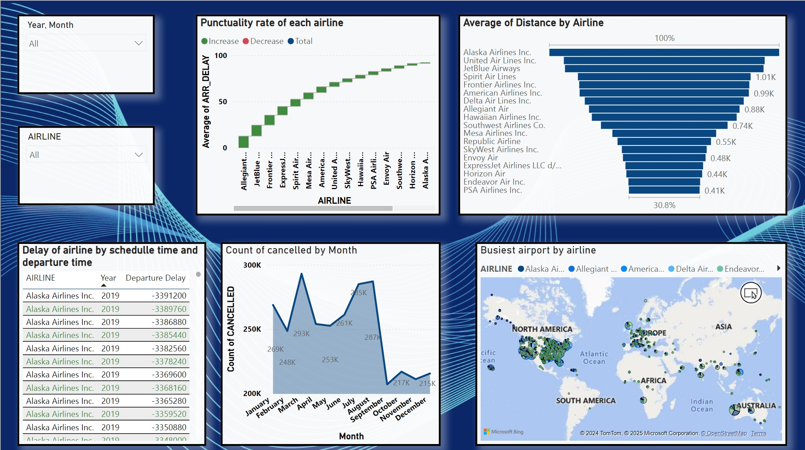

# Flight-Delay-and-Cancellation-Analysis-using-PowerBI

### Flight-Delay-Analysis

### Flight Delay Analysis Dashboard
The dashboard provides a comprehensive analysis of flight delays using Power BI, offering insights into the following aspects:

#### Year and Quarter Filter:

An interactive slicer to filter data by year and quarter for customized insights.

#### Airline Filter:

An interactive slicer to filter data by airlines for customized insights.

#### Average Arrival Delay of Airlines:

A Stacked bar chart highlighting the average arrival delays for various airlines, allowing users to identify carriers with the most delays.
#### Average Departure Delay by Origin:

A Clustered Column chart displaying average departure delays for different origin airports, enabling comparisons of delay times across locations.
#### Average Departure Delay by each Month:

A line graph depicting the average departure delay for each month over multiple years. This helps to observe trends and seasonal patterns in delays.
#### Frequency of Departure Delays by Reasons:

A pie chart illustrating the proportion of delays caused by different factors, including carriers, weather, NAS (National Airspace System), and instances with no delays.
#### Count of Delay Ranges by Airline:

A Stacked Column chart categorizing delays into ranges (e.g., 0–15 mins, 16–30 mins, etc.) for each airline. This provides detailed insights into the severity of delays experienced by different carriers, segmented by delay reasons(Carrier, NAS, Weather, or No Delay).

### Flight-Cancellation-Analysis 

### Flight Cancellation Analysis Dashboard
This dashboard provides a comprehensive analysis of flight cancellations across various routes, airlines, and reasons for cancellation. The visualizations aim to identify trends and key insights to better understand the factors influencing cancellations. Below are the key components of the dashboard:

#### Year and Quarter Filter:
A slicer allowing users to filter data by specific years and quarters for a detailed temporal analysis.

#### Airline Filter:
An interactive slicer to filter data by airlines for customized insights.

### Routes with Highest Number of Cancellations:
A Stacked Column chart showing the top origin-destination routes with the highest cancellation counts, segmented by delay reasons (Carrier, NAS, Weather, or No Delay).

### Average Cancellation by Airline Over the Years:
A Ribbon chart displaying the average percentage of cancellations by each airline, compared across the years 2019–2023.

### Cancellation Reasons Breakdown:
A donut chart illustrating the proportion of cancellations attributed to various delay reasons, with a significant percentage due to "No Delay" causes.

### Cancellation Rate by Airline:
An Area chart visualizing the cancellation rates of different airlines, helping identify airlines with consistently higher or lower cancellation rates.

### Average Cancellation Rate by Origin City:
A heatmap representing the geographical distribution of cancellation rates by origin city, highlighting regions with higher cancellation densities.

### Flight-Operations-Analysis

### Flight Operations Analysis Dashboard

This dashboard provides a comprehensive overview of key metrics related to flight operations, enabling stakeholders to monitor performance, identify trends, and make data-driven decisions. The visualizations focus on flight delays, punctuality, distance flown, and cancellation trends.

#### Year and Quarter Filter:

A slicer allowing users to filter data by specific years and quarters for a detailed temporal analysis. This enables dynamic exploration of performance trends over time.

#### Airline Filter:
An interactive slicer to filter data by airlines for customized insights.

#### Delay of Airline by Schedule Time and Departure Time:

A table displaying departure delay data for each airline across different years. This allows for analysis of historical trends in flight delays and identification of airlines with persistent delay issues. The filter allows users to focus on specific periods for deeper analysis.
#### Punctuality Rate of Each Airline:

A Waterfall chart visualizing the punctuality rate of each airline, highlighting those with consistently high or low on-time performance. This information is crucial for benchmarking and setting improvement targets. The filter can be used to compare punctuality rates across different quarters or years.
#### Average of Distance by Airline:

A Funnel chart showing the average distance flown by each airline. This provides insights into the operational scale and scope of each airline's network. The filter allows for analysis of distance flown trends over time.
#### Count of Cancelled by Month:

A Stacked Area chart illustrating the monthly count of flight cancellations. This helps identify seasonal or cyclical trends in cancellations and allows for proactive planning and resource allocation. The filter can be used to analyze cancellation trends for specific quarters or years.
#### Busiest Airport by Airline:

A world map visualizing the busiest airports served by different airlines. This provides a geographical perspective on airline operations and helps identify key hubs and routes. The filter can be used to analyze airport traffic patterns for specific periods.
